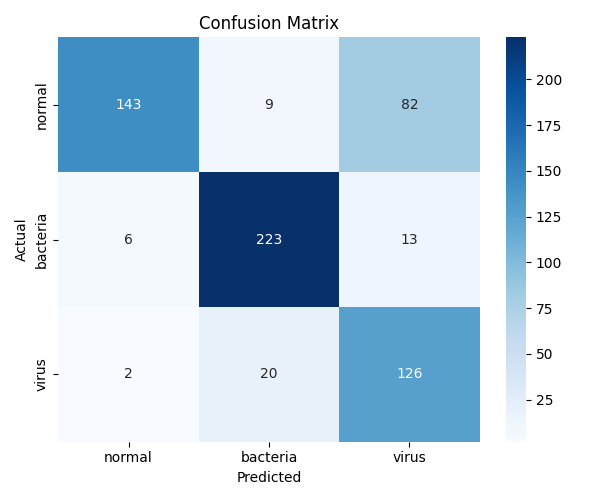

# CXR Pneumonia Classifier - Model Training
**Version**: 1.0\
**Author**: Isaac Lam

## Table of Contents
- Overview
- EfficientNet-V2-S
- Project Structure
- Setup
- Usage
- Results

## Overview
This project implements a deep learning training pipeline for image classification on a dataset of chest X-ray images. It leverages transfer learning by fine-tuning a pretrained EfficientNet_V2-L model using PyTorch. The pipeline supports experiment tracking with MLflow and records detailed logs for reproducibility and debugging. Designed to be modular and easily configurable, it enables streamlined experimentation and flexible adaptation to different training setups.

More information on the dataset can be found here: \
https://data.mendeley.com/datasets/rscbjbr9sj/2

## EfficientNet-V2-S

**EfficientNetV2-S** is a compact and efficient convolutional neural network (CNN) model optimized for image classification and other computer vision tasks. It is part of the EfficientNetV2 family, which builds on the original EfficientNet architecture with improved training speed and accuracy.

### Key Features

- **Progressive Learning**  
  Trains with gradually increasing image sizes and regularization, enhancing both speed and generalization.

- **Fused-MBConv Layers**  
  Combines standard convolution and MBConv in early layers for better efficiency on modern hardware.

- **Compound Scaling**  
  Balances depth, width, and resolution scaling for optimal performance across different model sizes.

- **Fast and Lightweight**  
  Offers a strong trade-off between accuracy and efficiency, making it suitable for resource-constrained environments.

### Architecture Highlights

| Feature             | Description                                                  |
|---------------------|--------------------------------------------------------------|
| Params              | ~22M                                                         |
| Input Size          | 384 × 384                                                    |
| Blocks              | Fused-MBConv (early) + MBConv (later)                        |
| Activation          | Swish                                                        |
| Attention           | SE modules used selectively in later MBConv layers           |


### References
[Tan, M., & Le, Q. (2021, July). Efficientnetv2: Smaller models and faster training. In International conference on machine learning (pp. 10096-10106). PMLR.](https://proceedings.mlr.press/v139/tan21a.html)

## Project Structure
```
📁 CXR_project
├── 📄 __init__.py
├── 📁 conf
│   ├── 📄 logging.yaml
│   └── 📄 main.yaml
├── 📄 eda.ipynb
├── 📄 readme.md
├── 📄 requirements.txt
├── 🖥️ run.sh
└── 📁 src
    ├── 📄 __init__.py
    ├── 📄 data_loader.py
    ├── 📄 evaluate.py
    ├── 📄 general_utils.py
    ├── 📄 main.py
    └── 📄 train_utils.py
```

## Setup
### Prequisites
- Python==3.10
- uv, pip or conda for dependency management
- (Recommended) Virtual environment (e.g., venv, conda)

### Installation
1. Navigate to the project directory.\
Make sure you're in the root directory of the project.
```
pip install -r requirements.txt
```

## Usage
### Training
To run the pipeline with the default configuration:
```bash
./run.sh
```
This script will:
- Load the dataset
- Initialize the model (EfficientNet-V2-l)
- Set up experiment tracking with MLflow
- Begin training with early stopping and checkpointing enabled.

### Configuration
This project uses Hydra for flexible and hierarchical configuration management. \
All configuration options are defined in `conf/main.yaml` and can be overridden via the command line.

To override any configuration parameter, use the following syntax:
```bash
./run.sh epochs=10 optimizer.lr=0.0001
```

You can also specify a different configuration file:
```bash
./run.sh --config-path configs/ --config-name custom_config.yaml
```
### Experiment Tracking with MLflow
MLflow is integrated for experiment tracking. You can enable or disable it via the config file:
```yaml
setup_mlflow: true
mlflow_tracking_uri: ./mlruns
mlflow_exp_name: "CXR"
mlflow_run_name: "efficientnet_v2_l"
resume: false
```
- **Tracking URI**: Specifies the MLflow server to log experiments to.
- **Experiment Name**: Organizes runs under a common experiment.
- **Run Name**: Identifies individual training runs.
- **Resume**: If True, resume a previous MLflow run instead of starting a new one.

### Device Settings
- **no_cuda**: Disable CUDA (GPU) if `true`.
- **no_mps**: Disable Apple MPS backend if `true`.

### Reproducibility
- **seed**: Random seed for reproducibility.

### Checkpoints
Model checkpoints are saved periodically during training to allow for recovery, analysis, or fine-tuning. The following configuration options control checkpoint behavior:
```yaml
model_checkpoint_interval: 2
model_checkpoint_dir_path: "checkpoints"
model_checkpoint_name: "model.pt"
model_config_dir_path: "config.json"
pytorch_model_name: "efficientnet_v2_l"
```
- **model_checkpoint_interval**: Defines how often (in epochs) the model is saved. \
e.g., with a value of 2, a checkpoint is saved every 2 epochs.
- **model_checkpoint_dir_path**: Directory where model checkpoints are stored.
- **model_checkpoint_name**: Filename for the saved model weights.
- **model_config_dir_path**: Path where the model configuration (e.g., architecture, hyperparameters) is saved.

### Logging
Training logs are written to the directory specified by:
```yaml
log_dir: "./logs"
```
Logs are written in JSON format to the following files (rotated at 10MB each):
- **logs/debug.log** – all debug and above
- **logs/info.log** – info and above
- **logs/warn.log** – warnings and above
- **logs/errors.log** – errors and above
- **Console** – info and above

### Model Definition
- **model.\_target_**: Torchvision model class.
- **model.weights**: Pretrained weights.
- **fine_tune**: Unfreezes two additional layers for fine-tuning.
- **load_checkpoint**: Load model from checkpoint.

⚠️ *Note: This project currently supports only the EfficientNet-V2-l architecture. \
If you wish to use a different model, you will need to:*
1. Modify the transform() function in data_loader.py to match the input requirements of your chosen architecture.
2. Update the replace_classifier() function in train_utils.py to replace the classifier layer accordingly.

### Optimizer and Loss
- **optimizer.\_target_**: Optimizer class (e.g., Adam).
- **optimizer.lr**: Learning rate.
- **loss_fn.\_target_**: Loss function (e.g., CrossEntropyLoss).
- **loss_fn.weight**: A manual rescaling weight given to each class. This will only be applied to training loss. Validation and test losses will remain unweighted.

### Metrics
- **metric.\_target_**: Evaluation metric (e.g., F1 Score).
- **metric.num_classes**: Number of classes.

### Data
- **data_path**: Path to dataset.
- **batch_size**: Batch size.
- **val_size**: Validation split ratio.
- **subset_size**: Optional subset size for debugging.

### Evaluation
To evaluate the trained model, run the following via the command line:
```bash
./run.sh evaluate=true
```
or set the following configuration options before running the script:
```yaml
evaluate: True
evaluate_dir_path: 'evaluate'
```
This will:
- Load the test dataset
- Run inference and log the test loss and metric
- Plot and save a confusion matrix
- Save test predictions to a JSON file
- All evaluation outputs are saved to the directory specified by `evaluate_dir_path`.

*Note: To evaluate a model without training, set 'evaluate=true' and 'epochs=0'.*

## Results
To reproduce the results from my experiments, follow these steps:
1. set `seed`=42
2. Run the initial training:
```bash
./run.sh
```
3. To further fine-tune the model using a pre-trained checkpoint:
```bash
./run.sh fine_tune=true \
          optimizer.lr=1e-5 \
          load_checkpoint="checkpoints/model.pt"
```
The model was evaluated on the test set with the following results:

**Test Loss**: 0.6357 \
**Test F1-Score**: 0.7762
