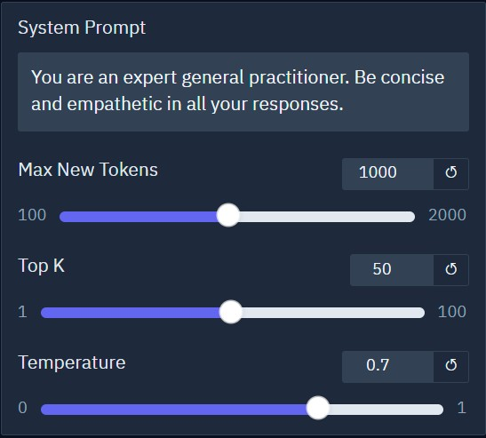
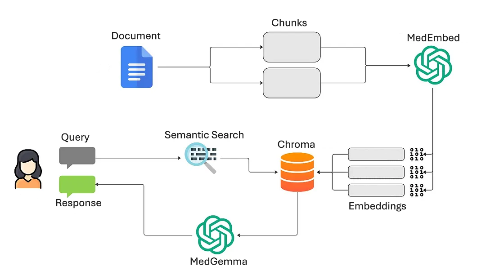

# AI-RAG Medical Assistant [MedGemma] 
Author: Isaac Lam\
Contact: isaac_lam_hk@aiap.sg

<!-- TABLE OF CONTENTS -->
<details>
  <summary>Table of Contents</summary>
  <ol>
    <li><a href="#project-overview">Project Overview</a>
    <li><a href="#project-structure">Project Structure</a></li>
    <li><a href="#setup-and-execution">Setup and Execution</a></li>
      <ul>
        <li><a href="#prerequisites">Prerequisites</a></li>
        <li><a href="#installation">Installation</a></li>
        <li><a href="#configuration">Configuration</a></li>
      </ul>
    <li><a href="#usage">Usage</a></li>
      <ul>
        <li><a href="#uploading-files-for-rag">Uploading files for RAG</a></li>
        <li><a href="#response-generation-settings">Response Generation Settings</a></li>
      </ul>    
    <li><a href="#pipeline-logic">Pipeline Logic</a></li>
    <li><a href="#key-components">Key Components</a></li>
      <ul>
        <li><a href="#embedding-model-medembed">Embedding Model</a></li>
        <li><a href="#vector-database-chroma">Vector Database</a></li>
        <li><a href="#retriever-logic-semantic-similarity-search">Retriever Logic</a></li>
        <li><a href="#llm-medgemma">LLM</a></li>
        <li><a href="#ui-framework-gradio">UI Framework</a></li>
      </ul>
    <li><a href="#evaluation-benchmarks">Evaluation Benchmarks</a></li>
      <ul>
        <li><a href="#base-model-evaluation">Base Model Evaluation</a></li>
        <li><a href="#custom-retrieval-evaluation">Custom Retrieval Evaluation</a></li>
    <li><a href="#limitations">Limitations</a></li>
  </ol>
</details>

## Project Overview

This repository implements a Retrieval-Augmented Generation (RAG) system powered by **Google’s Med-Gemma**, an instruction-tuned multimodal language model designed for medical and scientific tasks.

By integrating a document retrieval pipeline, the system enhances MedGemma’s ability to generate accurate, context-aware responses by referencing relevant external documents during inference.

### Objectives

- Improve factual accuracy and reduce hallucinations in generated outputs.
- Dynamically ground responses in domain-specific biomedical knowledge.
- Support complex medical and scientific question answering.

### System Architecture

The pipeline combines document indexing, semantic search, and generative modeling to deliver reliable and explainable outputs suitable for research and clinical support contexts.

A Gradio-based frontend is included to provide an interactive user interface for uploading documents, submitting queries, and viewing model responses. This makes the system accessible to both technical and non-technical users.

For more information about MedGemma, visit the  [official model page](https://developers.google.com/health-ai-developer-foundations/medgemma).

> ⚠️ **Disclaimer**  
> This system is intended for research and informational purposes only. It is not a substitute for professional medical advice. Always consult a qualified healthcare provider for medical concerns or decisions.

## Project Structure
```
Project_directory
├── README.md
├── config.yaml
├── pyproject.toml
├── uv.lock
├── run.sh
├── eval
│   ├── eval.csv
│   ├── report.pdf
├── src
│   ├── RAG.py
│   ├── frontend.py
│   └── main.py
├── images
│   ├── pipeline.png
│   ├── settings.jpg
└── LICENSE.txt
```

## Setup and Execution
### Prerequisites
- `python 3.12+`
- `curl`
- `bash`
- CUDA 12.8+ compatible NVIDIA GPU

### Installation
#### Clone the repository
```bash
git clone https://github.com/isaaclhk/Projects.git
cd RAG-MedGamma
```

#### Run the script
```bash
./run.sh
```
This script will:
1. Check if uv is installed and install it if missing
2. Sync dependencies from pyproject.toml.
3. Activate the virtual environment.
4. Launch the application.

Once the script completes, you should see a message like:
```
Device set to use cuda
* Running on local URL:  http://127.0.0.1:7860
* To create a public link, set `share=True` in `launch()`.
```
Open your browser and go to http://localhost:7860 to access the app locally. \
*Note: Port 7860 is the default for Gradio apps. If it's already in use, Gradio will automatically switch to the next available port (e.g., 7861, 7862, etc.). Always check the terminal output for the actual port number.*

### Configuration
#### Model variant
Specify the model variant in the config file. 
```yaml
model_variant: 4b-it
```
Available options:
- `4b-it` instruction-tuned variant
- `4b-pt` pre-trained variant
- `27-text-it` 27B instruction-tuned text-only variant
- `27b-it` 27B instruction-tuned variant

#### Quantization
To enable 4-bit quantization for reduced memory usage and faster inference, set:
```yaml
use_quantization: true
```
This will load the model using double quantization, which compresses weights into 4-bit precision while maintaining performance for most tasks.

*⚠️ Note: Quantization may slightly affect output quality depending on the model variant and task complexity. Use with caution for high-precision applications*

#### Embedding Model
```yaml
embed_model: abhinand/MedEmbed-small-v0.1
```
You can replace this with any other Hugging Face-compatible embedding model. \
For example, larger variants of MedEmbed are available:
- abhinand/MedEmbed-base-v0.1
- abhinand/MedEmbed-large-v0.1

## Usage

### Uploading Files for RAG

To provide additional context for the language model, users can upload documents and images via the Gradio interface. These files are processed and indexed to support retrieval-augmented generation.

#### Supported File Types

##### Document Formats
- `.txt` — Plain text
- `.pdf` — PDF documents
- `.docx` — Microsoft Word
- `.csv` — Comma-separated values
- `.pptx` — Microsoft PowerPoint

##### Image Formats (via PIL)
- `.png`, `.jpg`, `.jpeg`, `.bmp`, `.gif`, `.tiff`, `.webp`, `.ppm`, `.pgm`, `.pbm`

These formats are accepted through the respective upload components in the UI. Uploaded content is chunked, embedded, and stored in the vector database to enhance the relevance and accuracy of generated responses. See [Pipeline Logic](#pipeline-logic) for more details.

### Response Generation Settings

<figure>
    
    <figcaption>Response Generation Settings</figcaption>
</figure>

Adjust the following settings on the gradio user interface to customize the response generation:
- `Max New Tokens`: Controls the maximum number of tokens the model can generate in a single response. Increasing this value allows for longer outputs, while decreasing it limits the length.
- `Top K`: Limits the model’s choices to the top K most likely next tokens. A lower value makes the output more focused and deterministic, while a higher value introduces more randomness and variety.
- `Temperature`: Adjusts the randomness of the output. Lower values make the model more confident and conservative, while higher values make it more creative and diverse.

## Pipeline Logic

MedGemma-RAG pipeline: Adapted from [Towards AI](https://pub.towardsai.net/introduction-to-retrieval-augmented-generation-rag-using-langchain-and-lamaindex-bd0047628e2a)

1. **User Input via Gradio UI**  
   The user uploads one or more documents and submits a natural language query through the Gradio interface.

2. **Document Chunking and Embedding**  
   Uploaded documents are split into manageable chunks. Each chunk is then converted into a dense vector representation using a domain-specific embedding model (e.g., MedEmbed).

3. **Vector Storage in Chroma**  
   The resulting embeddings are stored in a Chroma vector database, enabling efficient similarity-based retrieval.

4. **Semantic Retrieval**  
   When a query is submitted, it is also embedded and compared against the stored vectors. The top `k` most semantically similar chunks are retrieved based on cosine similarity.

5. **Contextual Prompt Construction**  
   The retrieved chunks are appended as context to the original user query. This retrieval-augmented prompt is then passed to the MedGemma LLM.

6. **LLM Response Generation**  
   MedGemma generates a response grounded in the retrieved context. The final answer is displayed to the user via the Gradio UI.

## Key Components

This section outlines the core components used in the MedGemma-RAG pipeline, along with the rationale for their selection.

### Embedding Model: **MedEmbed**
A domain-specific embedding model trained on biomedical literature. It transforms document chunks and queries into dense vector representations that capture semantic meaning, enabling accurate retrieval in medical contexts.

### Vector Database: **Chroma**
Chroma is used to store and index the embeddings efficiently. It supports fast similarity search and integrates well with LangChain, making it suitable for scalable RAG applications.

### Retriever Logic: **Semantic Similarity Search**
The retriever compares the query embedding against stored document embeddings using cosine similarity. The top `k` most relevant chunks are selected to provide contextual grounding for the LLM.

### LLM: **MedGemma**
MedGemma is a biomedical large language model fine-tuned for clinical and scientific tasks. It leverages the retrieved context to generate accurate, domain-aware responses to user queries.

### UI Framework: **Gradio**
Gradio provides an intuitive web interface for users to upload documents and interact with the system. It simplifies deployment and testing of ML models with minimal overhead.

## Evaluation Benchmarks

MedGemma models were rigorously evaluated across a diverse set of medical and general-purpose benchmarks to assess their capabilities in both vision-language and text-only tasks. For more details, see the [full technical report](https://arxiv.org/pdf/2507.05201). Key evaluation categories included:

- **Medical Text Question Answering**: Benchmarked on datasets such as MedQA, MedMCQA, PubMedQA, MMLU-Med, AfriMed-QA, and MedXpertQA. MedGemma 27B achieved state-of-the-art performance among open models, outperforming base Gemma models and approaching larger proprietary models.

- **Medical Image Classification**: Evaluated on chest X-rays (MIMIC-CXR, CheXpert, CXR14), dermatology (US-Derm MCQA), histopathology (PathMCQA), and ophthalmology (EyePACS). MedGemma 4B demonstrated strong zero-shot generative classification performance, often surpassing larger generalist models.

- **Visual Question Answering**: Assessed on SLAKE, VQA-RAD, and MedXpertQA. MedGemma 4B outperformed baseline models and was competitive with larger fine-tuned systems.

- **Chest X-ray Report Generation**: Using the MIMIC-CXR dataset, MedGemma 4B achieved near state-of-the-art performance (RadGraph F1: 29.5), with 81% of generated reports rated as clinically equivalent or superior to original reports in expert evaluations.

- **Agentic Behavior**: On the AgentClinic benchmark, MedGemma 27B exceeded human physician performance on AgentClinic-MedQA and approached top-tier models on AgentClinic-MIMIC-IV.

- **General-Purpose Tasks**: Evaluated on MMLU Pro, Global MMLU Lite, and MMMU to assess trade-offs in general reasoning. Despite being optimized for medical tasks, MedGemma showed only slight performance drops compared to the general-purpose Gemma 3 models of the same size, demonstrating its versatility for both specialized and broad instruction-following applications.

These results highlight MedGemma’s effectiveness as a domain-specialized foundation model, offering strong performance across modalities while remaining efficient and adaptable for downstream medical applications.

### Custom Retrieval Evaluation
To install additional dependencies for evaluation:
```bash
uv sync --group eval
```
This project uses the `Ragas` evaluation framework to assess the performance of the Retrieval-Augmented Generation (RAG) system. Evaluation was conducted exclusively on the `4b-it` model variant. To test other variants, update the configuration in `config.py` and re-run `eval.ipynb`.

Throughout the evaluation, the model was given a standardized system prompt :

> "You are a helpful medical assistant". 

A [sample paper](https://www.medrxiv.org/content/10.1101/2025.04.29.25326704v2) was provided for context retrieval. 
A curated dataset of 25 question-answer pairs, derived from the paper, was used to assess the system's ability to retrieve and generate accurate, relevant responses.

The evaluation focused on the following key metrics:

- **Context Precision**  
  Measures the proportion of retrieved context that is actually relevant to answering the question.

- **Context Recall**  
  Assesses whether all necessary information required to answer the question was successfully retrieved.

- **Answer Relevancy**  
  Evaluates how directly and appropriately the generated answer addresses the question.

- **Faithfulness**  
  Checks whether the generated answer is factually consistent with the retrieved context, avoiding hallucinations.

The following results were obtained from the evaluation:
- **Context Precision**: `0.6633`  
- **Context Recall**: `0.6000`  
- **Answer Relevancy**: `0.8015`  
- **Faithfulness**: `0.7060`

These results suggest that while the system generates relevant and faithful answers, there is room for improvement in retrieving more complete and targeted context.

For full implementation details, refer to `eval.ipynb`.

## Limitations

While this implementation of a RAG system using MedGemma demonstrates promising capabilities, there are several limitations and areas for future enhancement:

#### 1. Base Model Constraints
This system is built on the base MedGemma model without fine-tuning. For production-grade applications, it is strongly recommended to:
- Fine-tune the model on domain-specific datasets.
- Perform rigorous validation and benchmarking to ensure reliability and accuracy in real-world scenarios.

#### 2. No Restrictions on File Size or Token Limits
Currently, there are **no enforced limits** on:
- Number of uploaded files
- File size
- Input token length

While this offers flexibility, it may lead to performance bottlenecks or memory issues. Introducing configurable limits or streaming-based processing could improve scalability and robustness.

#### 3. Limited Contextual Memory
The system does not maintain long-term memory across sessions. Implementing persistent memory or session-based context tracking could enhance user experience in multi-turn interactions.

#### 4. Security and Privacy Considerations
This implementation does not include built-in mechanisms for:
- Data anonymization
- Access control
- Secure file handling

## License
This project is licensed under the MIT License. See `LICENSE.txt` for more information.

## References
1. Google. (n.d.). MedGemma | Health AI Developer Foundations. Google for Developers. https://developers.google.com/health-ai-developer-foundations/medgemma
2. Mahamulkar, P. (2024, February 9). Introduction to retrieval-augmented generation (RAG) using LangChain and LlamaIndex. Towards AI. https://pub.towardsai.net/introduction-to-retrieval-augmented-generation-rag-using-langchain-and-lamaindex-bd0047628e2a
3. Sellergren, A., Kazemzadeh, S., Jaroensri, T., Kiraly, A., Traverse, M., Kohlberger, T., ... & Yang, L. (2025). MedGemma Technical Report. arXiv preprint arXiv:2507.05201.

